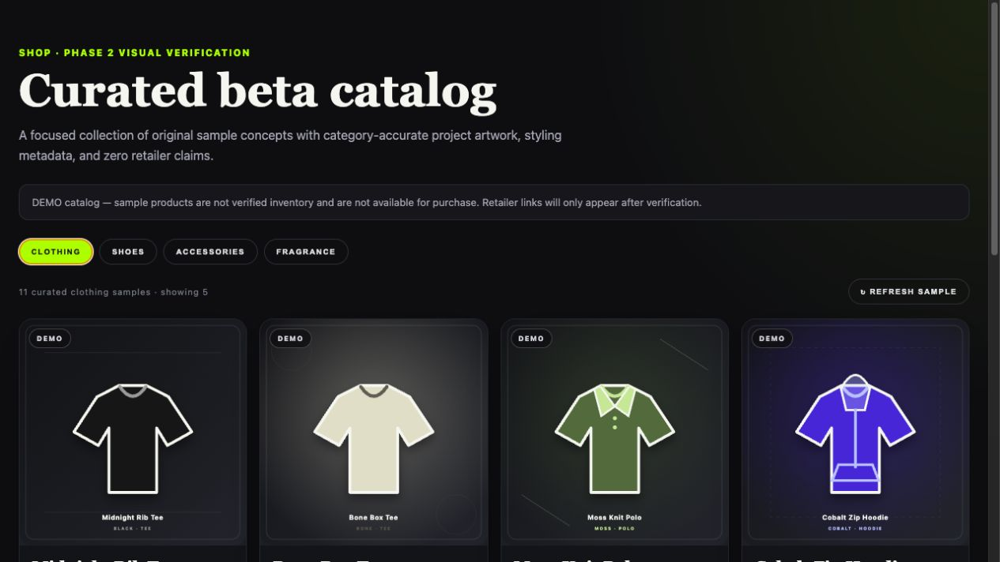
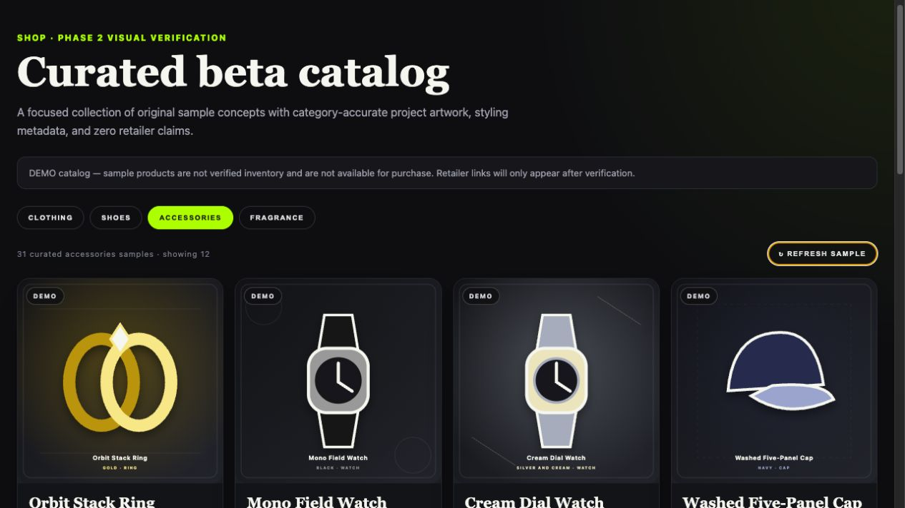

# Shop Phase 2 visual verification

Verified locally on July 28, 2026 against the Phase 2 manifest and generated project assets. The
visual harness mirrored the Shop card content and safety state while the database migration
remained unapplied in the pull-request environment.

## Clothing

- Clothing rendered with category-specific tee, polo, hoodie, trouser, and outerwear artwork.
- Product name, color, category, description, and metadata chips matched the rendered concept.
- Every visible card retained the `DEMO`, `Sample only`, and `View Sample` states.

## Accessories and rotation

- Eyewear, jewelry, watches, headwear, belts, bags, socks, scarves, wallets, and grills each use
  subtype-appropriate artwork.
- The 12-item accessory window was refreshed in the browser. The next 12 items had **zero
  immediate repeats**.
- Clothing, shoes, accessories, and fragrance were each inspected at the desktop layout.
- Rendered images reported complete 800 × 800 dimensions, with no browser console errors.

## Catalog safety and integrity

- 51 curated products and 51 unique project-owned SVG files.
- No LoremFlickr, Picsum, Unsplash, remote retailer photography, or other external image host.
- All generated rows are `is_demo = true`, `availability = 'sample_only'`, with null retailer,
  purchase URL, discount/original price, and last-checked values.
- The migration removes only existing demo rows; any future verified retailer inventory is left
  untouched.
- The automated validation gate rejects duplicate identities, missing or remote images,
  unsupported kind/category pairs, and commerce metadata on demo rows.
